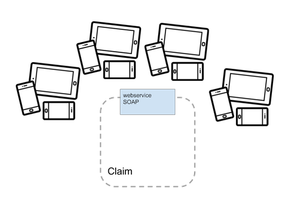
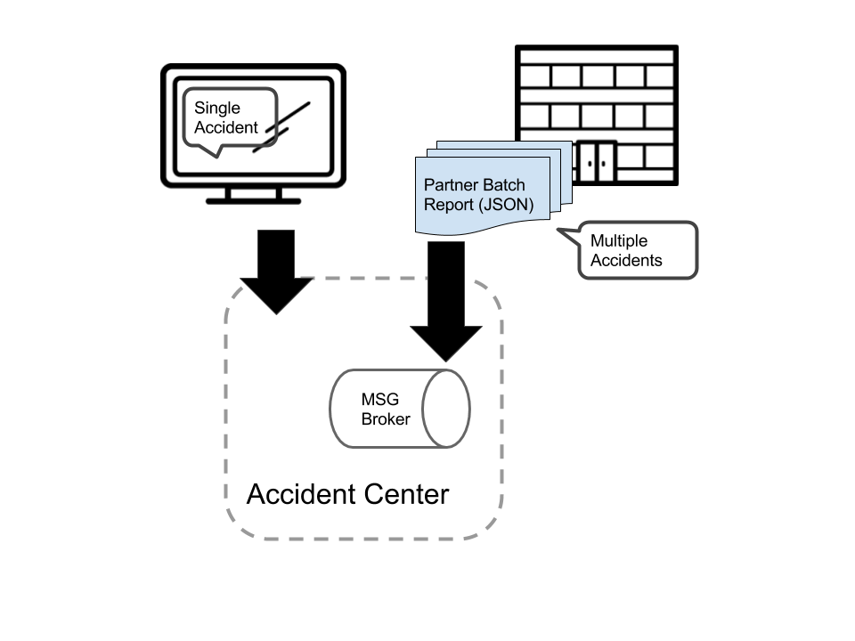
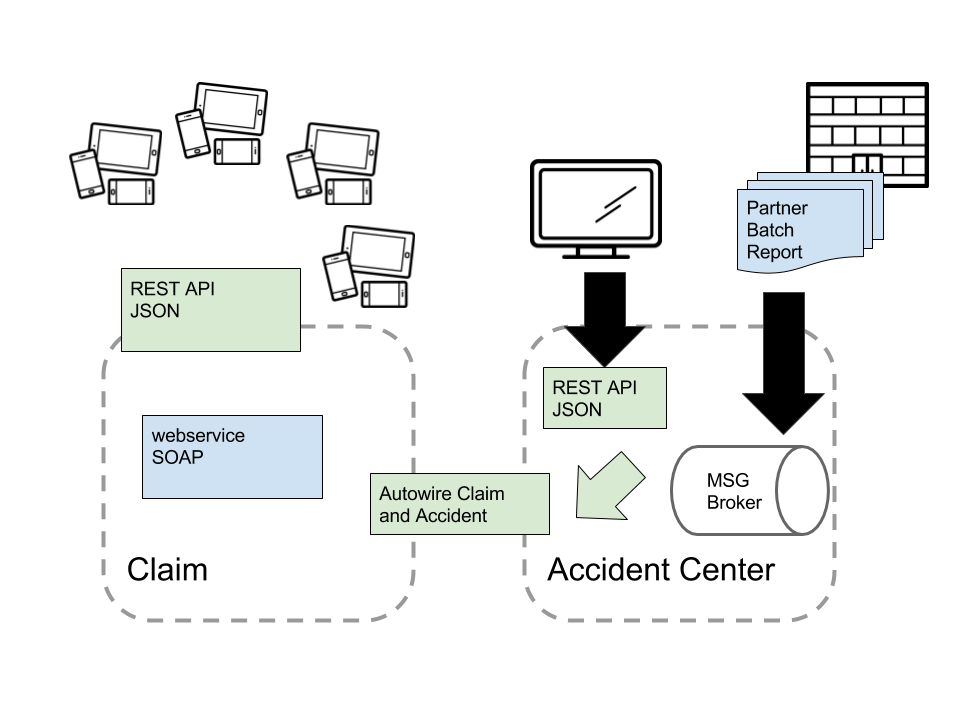

## Red Hat Insurance

Red Dog Corporation is one of the largest providers of car and life insurance in the country. The company also insures motorcycles, boats, RVs and commercial vehicles, and provides home insurance through select companies. Being one of the largest auto insurers, with over 13 million policies in force. Red Dog primarily offers its services through the Internet or by phone and through partner independent insurance agents. Red Dog's Agency business sells insurance through more than 30,000 independent insurance agencies and redhatauto.com where customers can quote their own policies and then contact an agent to complete the sale.

To stay competitive, they decide to start the new "Digital transformation Project" by transforming their entire business and organizational activities, processes to fully leverage the digital technologies. Part of their project is expand their partner ecosystem and enhance their customer experience. 

### The Claim System

Currently Red Dog Corporation has an existing webservices that handles all the claim request from partners. Since 2 years ago, Red Hat Insurance notice increasing amount of their partner are providing mobile devices to their agents. And the time it takes for these mobile app to adopt their current webservice takes longer and takes months if updates needed to the claim system, as they need to wait for all partner system to reflect the changes. Demands for REST API is now a high priority. But it takes time for Red Dog to completely refactor their existing webservice due to the technical debt. 

### Accident alert and Claim

One partner accident customer helpdesk center collects report of the clients and report back to Red Dag daily. And would like to automate and kick off the claim process for their client. as well as allowing instant report from partner systems. Red Dog Corporation would like to integrate both Alert and Claim. As much as Red Dog's urgency to provide these capability. They were also concern about the security of the service they provide. No compromise when it comes to the safty of the client data and it's system.

### Microservices, Cloud Native and API

Red Dog Corporation reach out to Red Hat. Red Hat is known for having the resources and infrastructure to support the cloud-native journey from start to finish with open source tools—from platform, containers to microservices. As an proud SA of Red Hat, you will be conducting PoC for Red Dog with a partner. 

Here are some of the input from our key sponsor in Red Dog. 

- Most of our developer has been developing applications on traditional monolithic applications. Painless migration to cloud native architecture will be our primary goal.
- Flat learning curve is essential when it comes to using the technology. 
- Show us how to do microservice right! 

For this PoC, you will need to show Red Dog Corp 

- Build a brand new REST API for accident center to receive single accident report.
- Collect all accident reports from all sources and automatically file a claim.
- Converts an existing webservice to an REST API with API Standard Documentations.

